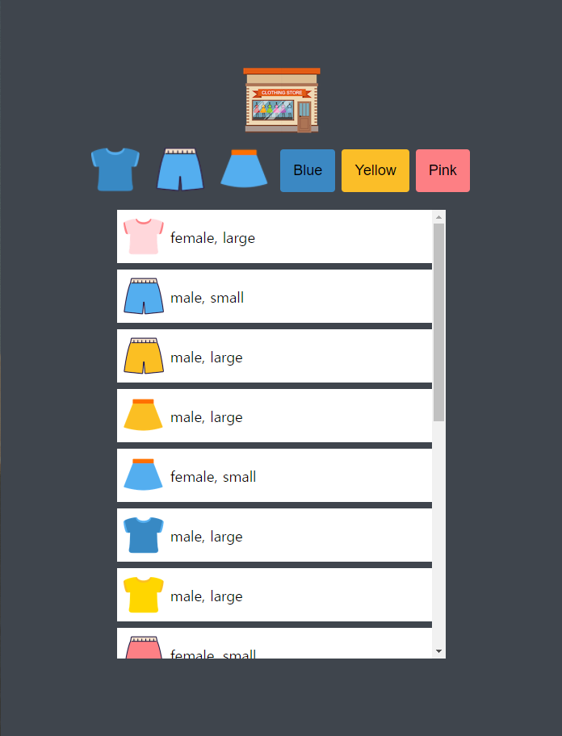
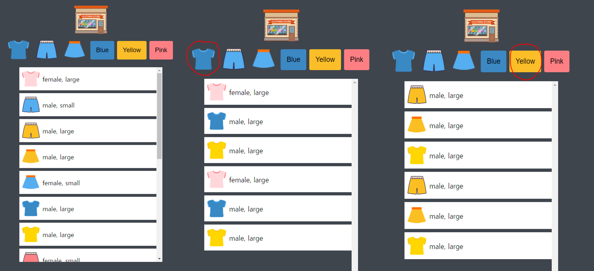

# mini shopping game project

### 설명
쇼핑몰 미니게임은 쇼핑 리스트를 6가지 카테고리로 분류해 사용자로 하여금 카테고리별 쇼핑 리스트를 출력할 수 있게 하는 간단한 프로그램이다. 시작 화면은 다음과 같다. 사용자는 로고, 6개의 카테고리 버튼을 클릭할 수 있고, 쇼핑 리스트를 스크롤을 통해 살펴볼 수 있다.

### 스택 
HTML, CSS, vanila JS

### 주요 기능
* 로고 클릭 시 모든 리스트 출력
* 옷 버튼 클릭 시 해당 카테고리에 해당하는 쇼핑 리스트 출력
* 색상 버튼 클릭 시 해당 카테고리에 해당하는 쇼핑 리스트 출력

---
### ref
https://academy.dream-coding.com/courses/mini-shopping

