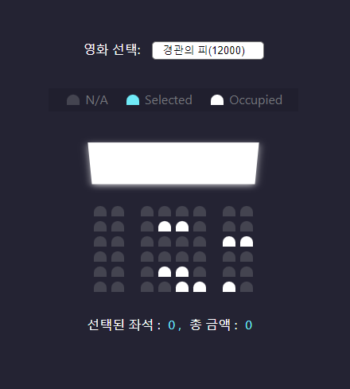
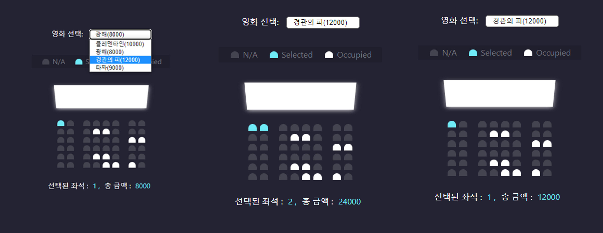

# movie ticket Booking program 

### 설명
영화 예매 프로그램은 사용자가 영화를 고르고, 좌석을 선택하면 선택된 좌석 수와 그에 해당하는 총 금액을 계산해주는 프로그램이다. 레퍼런스의 "movie seat booking"의 livedemo를 참고하여 구현하였다.

### 스택 
HTML, CSS, vanila JS

### 주요 기능
* 영화 선택
* 좌석 선택 & 취소 기능
* 선택한 좌석 개수와 그에 따른 총 금액 출력

---
### ref
[참조 사이트](https://github.com/bradtraversy/vanillawebprojects)  
[원본 사이트](https://www.udemy.com/course/web-projects-with-vanilla-javascript/?referralCode=F9B7C7FED834F91ADE75)